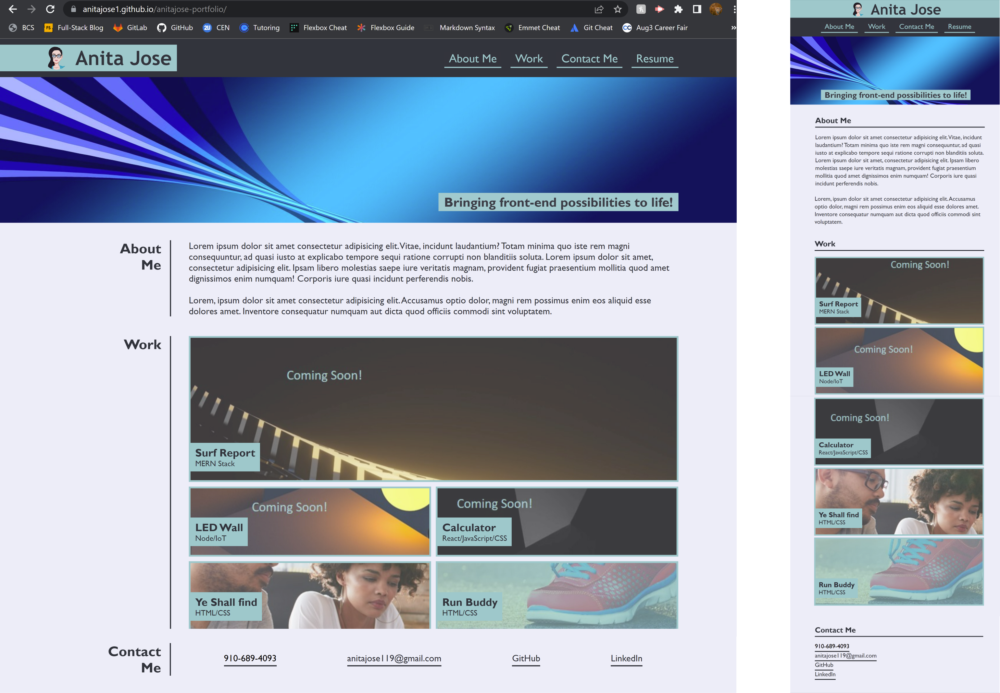

# Anita Jose - Portfolio

## Description

This portfolio is a collection of projects I've worked on. You can view the deployed applications and access the README/codebase to view the thought process behind development.

I have left placeholders for the upcoming project that I will add once they're deployed.

To build this portfolio, I have used HTML and CSS (including flexbox and media queries to make the application mobile responsive). I will, however, be updating the application's functionality and appearance as I learn more programming languages such as JavaScript.  

The deployed portfolio can be viewed at: https://anitajose1.github.io/anitajose-portfolio/

